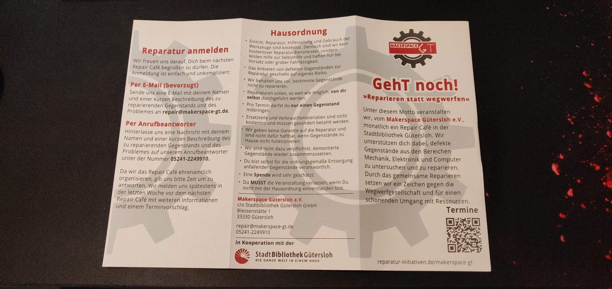
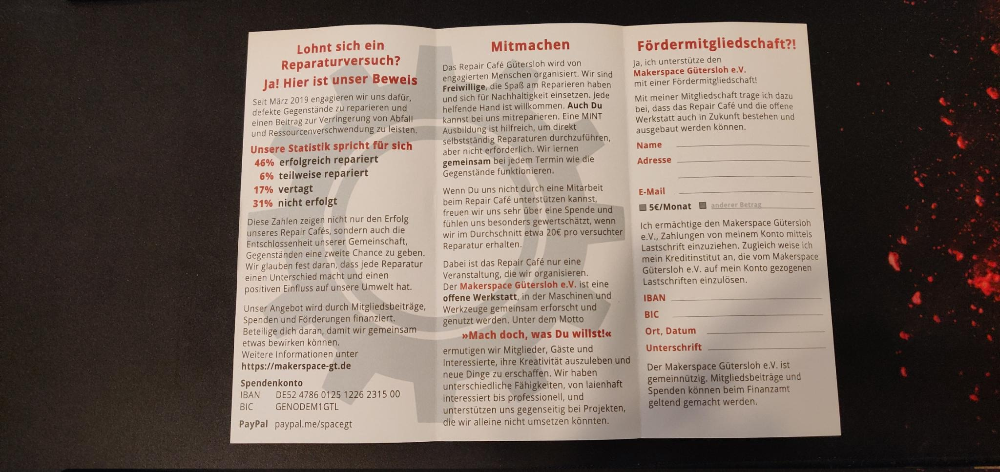

# GehT noch

## Zuwendungsempfängerin / Zuwendungsempfänger im weiteren Antragsteller

### Rechtsform des Antragstellers

- [ ] Juristische Person des öffentlichen Rechts
- [x] Juristische Person des privaten Rechts
- [ ] Personengesellschaft
- [ ] Natürliche Person

### Anrede

Verein

### Vereinsname

Makerspace Gütersloh e.V.

### Weitere Bezeichnung

c/o Die WEBEREI – Bürgerkiez gGmbH

### Straße / Nr

Bogenstraße 1-8

### PLZ

33330

### Ort

Gütersloh

### Gemeindekennziffer

05754008

### Postfachnummer

### PLZ Postfach

### Ort Postfach

### Registergericht + Vereinsregisternummer

Gütersloh VR 1720

### USt-IdNr. (soweit vorhanden)

35159138437

### Telefon

05241-2249910

### Fax

### E-Mail

info@makerspace-gt.de

### Website

makerspace-gt.de

### Kontoinhaber

Makerspace Gütersloh e.V.

### IBAN

DE52 4786 0125 1226 2315 00

### BIC

GENODEM1GTL

### Kreditinstitut

Volksbank Bielefeld-Gütersloh eG

## Vertretungsberechtigte / Vertretungsberechtigter

### Anrede

Ohne

### Titel

### Vorname / Name 1

Michael

### Nachname / Name 2

Prange

### Organ / Funktion / Vertretungsart

Vorstand

### Straße / Nr

### PLZ

### Ort

### Telefon

### Fax

### E-Mail

michael@makerspace-gt.de

### DE-Mail

## Ansprechpartnerin / Ansprechpartner

### Anrede

Ohne

### Titel

### Vorname / Name 1

Michael

### Nachname / Name 2

Prange

### Straße / Nr

### PLZ

### Ort

### Telefon

### Fax

### E-Mail

michael@makerspace-gt.de

## Maßnahmenangaben

### Kurzbezeichnung der Maßnahme

GehT noch

### Beschreibung der Maßnahme

Der Makerspace Gütersloh veranstaltet seit März 2019 monatlich ein Repair Café in Kooperation mit der Stadtbibliothek Gütersloh. Ziel des Repair Cafés ist es Nachbarschaftshilfe zu leisten, indem gemeinsam mit den Gästen defekte Gegenstände analysiert und repariert werden. Damit setzen wir ein Zeichen gegen die Wegwerfgesellschaft und für einen schonenden Umgang mit Ressourcen.
Mit der Maßnahme »GehT noch« soll die Ausstattung um professionelles Messequipments erweitert werden, um die Analyse von elektronischen Geräten zu ermöglichen. Geplant sind die Anschaffung von einem Gerätetesten, einem Oszilloskop, einer Strommesszange zzgl. weiterer Messleitungen und eines berührungslosen Spannungstesters. Weiterhin ist der Druck von neuen Flyern und Informationsplakaten geplant, um über die Möglichkeiten des Repair Café zu informieren.

### Durchführungszeitraum (von)

02.10.2023

### Durchführungszeitraum (bis)

31.12.2023

### Regierungsbezirk

Detmold

### Kreis / Kreisfreie Stadt

Gütersloh

### Stadt / Gemeinde

Gütersloh

### Gemeindekennziffer

05754008

## Aufstellung der Gesamtausgaben

| Nummer | Art der Leistung                     |   Betrag |
| :----: | ------------------------------------ | -------: |
|   1    | [Gerätetester][1]                    | 470,00 € |
|   2    | [Oszilloskop][2]                     | 350,00 € |
|   3    | [Multimeter mit Strommesszange][3]   |  80,00 € |
|   4    | [Multimeter mit Oszilloskop][4]      |  85,00 € |
|   5    | [Messleitungen][5]                   |  20,00 € |
|   6    | [berührungsloser Spannungstester][6] |  20,00 € |
|   7    | [Werbematerial][7]                   |  75,00 € |

## Finanzierungsplan

|                                         |            |
| --------------------------------------- | ---------: |
| Gesamtkosten                            | 1.100,00 € |
| abzgl. Einnahmen und Leistungen Dritter |     0,00 € |
| Zuwendungsfähige Gesamtausgaben         | 1.100,00 € |
| Beantragte Förderung                    | 1.000,00 € |
| Eigenanteil                             |   100,00 € |

## Die Antragstellerin oder der Antragsteller erklärt, dass

- [x] mit der Maßnahme noch nicht begonnen wurde und auch vor Bekanntgabe des Zuwendungsbescheides nicht begonnen wird; als Vorhabenbeginn ist grundsätzlich der Abschluss eines der Ausführung zuzurechnenden Lieferungs- oder Leistungsvertrages zu werten,
- sie oder er zum Vorsteuerabzug
  - [x] nicht berechtigt ist,
  - [ ] berechtigt ist und dies bei der Berechnung der zuwendungsfähigen Ausgaben (Gesamtkosten und Finanzierungsplan) berücksichtigt hat (Preise ohne abzugsfähige Umsatzsteuer),
- [x] sie oder er für die Durchführung der Maßnahme keine weitere öffentliche Förderung erhält und auch nicht plant eine weitere öffentliche Förderung einzuwerben,
- [x] die Angaben in diesem Antrag (einschließlich Antragsunterlagen) vollständig und richtig sind.

## Dokumentenupload

Es können noch 10 Dokument(e) hochgeladen werden.

| Bezeichnung | Name |
| :---------- | :--- |

## Hinweise zum Datenschutz

Datenschutzerklärung

- [x] Ich habe die Hinweise zum Datenschutz zur Kenntnis genommen.

Nur wenn die Förderung nicht durch eine juristische Person des öffentlichen Rechts beantragt wird:

- [x] Im Falle einer Förderung stimme ich der Weitergabe und Veröffentlichung meiner Förderdaten (Bezeichnung des Förderprojektes, Vorname und Name der/des Geförderten, Förderhöhe) durch die Bewilligungsbehörde oder die Staatskanzlei zu.

## Sachbericht

Die Umsetzung des Projekts »GehT noch!« begann mit der Bewilligung am 20. September 2023 und endete nach 16 Wochen am 10. Januar 2024 mit dem Erhalt von 1.000 Flyern (obwohl nur 500 bestellt wurden). Die Bestellungen erfolgten zwischen dem 5. Oktober und dem 31. Dezember. Die Lieferung der Messgeräte und des Werbematerials erfolgte zwischen dem 23. Oktober und dem 10. Januar.

Um eine wirtschaftliche Verwendung der Fördermittel zu gewährleisten, wurden Nachfragen bei den leistenden Unternehmen gestellt. Die Firma PeakTech fand unser Engagement unterstützenswert und spendete uns ein Multimeter, die Messleitungen und den Spannungsprüfer. Dadurch wurden Mittel frei, um die geplanten Ausgaben sinnvoll zu ergänzen. Ein digitales Mikroskop wurde angeschafft, um feine Lötarbeiten durchführen zu können. Außerdem wurden Akkus bestellt, da nicht alle Messgeräte mit Batterien ausgestattet waren. Und es wurden USB-Sticks bestellt, um die Präsentation [Impression | Makerspace GT](https://www.youtube.com/watch?v=ppTO1oIRjuE) während des Repair Cafés auf dem Monitor in der Stadtbibliothek zeigen zu können und ein Medium für eine Datenrettung zu haben.

Das neue Equipment konnte bereits bei den Repair Cafés im November, Dezember, Januar und Februar eingesetzt werden. Insbesondere die Multimeter, Messleitungen und der berührungslose Spannungsprüfer fanden sofort ihren Einsatz. Im Oktober wurde uns der Mangel eines digitalen Mikroskops bewusst, als wir nicht in der Lage waren, eine Mikro-USB-Buchse zu löten.

Für das Jahr 2024 erhoffen wir uns durch die niederschwellige Möglichkeit der Flyer Fördermitglieder für unseren Verein zu gewinnen.
Außerdem sind interne Repair Cafés und Workshops geplant, um eigene Geräte zu reparieren und den professionellen Umgang mit Messgeräten zu erlernen.
Nicht zuletzt wollen wir der Stadtbibliothek eine konkrete (Reparatur-)Werkzeugempfehlung geben, damit sie ihre [Bibliothek der Dinge](https://www.stadtbibliothek-guetersloh.de/bibliothek-der-dinge/) erweitern kann und wir weniger eigenes Werkzeug zum Repair Café mitnehmen müssen.

Die Unterlagen zu dieser Förderung sind auf GitHub (https://github.com/makerspace-gt/GehT-noch-fund) dokumentiert, sodass sich auch andere Initiativen daran orientieren und davon profitieren können.

## Zahlenmäßiger Nachweis

| Nr. | Leistendes Unternehmen        | Art der Leistung                       |  Zahldatum | Betrag in EUR | Geplant in EUR |
| :-: | ----------------------------- | -------------------------------------- | ---------: | ------------: | -------------: |
|  1  | Ewald Abels                   | [BENNING Gerätetester ST 710][1.1]     | 06.11.2023 |      483,60 € |       470,00 € |
|  2  | karel-h@eBay                  | [voltcraft Oszilloskop DSO-1084E][2.1] | 05.10.2023 |      285,00 € |       350,00 € |
|  3  | PeakTech                      | [Multimeter mit Strommesszange][3.1]   | 18.10.2023 |        0,00 € |        80,00 € |
|  4  | Amazon                        | [Multimeter mit Oszilloskop][4.1]      | 08.10.2023 |       70,86 € |        85,00 € |
|  5  | PeakTech                      | [Messleitungen][5.1]                   | 18.10.2023 |        0,00 € |        20,00 € |
|  6  | PeakTech                      | [berührungsloser Spannungstester][6.1] | 18.10.2023 |        0,00 € |        20,00 € |
|  7  | FLYERALARM                    | [Werbematerial][7.1]                   | 31.12.2023 |       59,32 € |        75,00 € |
|  8  | Zeplus Global@Amazon          | [Digital Mikroskop][8]                 | 08.10.2023 |       47,99 € |         0,00 € |
|  9  | Amazon                        | [AA Akkus][9]                          | 01.11.2023 |       37,26 € |         0,00 € |
| 10  | TTT-Filmservice@Amazon        | [AAA Akkus][10]                        | 01.11.2023 |        8,83 € |         0,00 € |
| 11  | SSK Corporation Direct@Amazon | [USB-Sticks][11]                       | 01.11.2023 |       33,48 € |         0,00 € |
|     |                               | **Summe**                              |            |    1.026,34 € |     1.100,00 € |
|     |                               | **Offen**                              |            |       73,66 € |         0,00 € |

## Bestätigungen

Es wird bestätigt, dass...

- [x] die Nebenbestimmungen des Zuwendungsbescheides beachtet worden sind,
- [x] die Ausgaben notwendig waren, wirtschaftlich und sparsam verfahren worden ist und die Angaben im Verwendungsnachweis mit den Büchern und Belegen übereinstimmen,
- [x] für die Durchführung der Maßnahme keine weitere Förderung von Dritten gewährt wurde oder noch gewährt wird,
- [x] es bei der Durchführung zu keiner Überfinanzierung gekommen ist,
- [x] die Originalbelege für die Dauer von fünf Kalenderjahren nach Vorlage dieses Verwendungsnachweises für Prüfzwecke vorgehalten werden und
- [x] die Angaben in diesem Nachweis vollständig und richtig sind.

## Dokumentenupload

Es können noch 10 Dokument(e) hochgeladen werden.

| Bezeichnung                                | Name                                                     |                                                   |
| :----------------------------------------- | :------------------------------------------------------- | ------------------------------------------------- |
| Gerätetester                               | ad104479e668cb978f0f4da5a68a2781.jpeg                    |  |
| Oszilloskope                               | a5eb7dcf9bca694f3671232a6cdfa6a7.jpeg                    |  |
| Multimeter, Messleitungen, Spannungsprüfer | b7a698b7a8084e5831f3770665a8bc8f.jpeg                    |  |
| GehT noch! Flyer                           | [GehT noch! Flyer.pdf](images/GehT%20noch!%20Flyer.pdf) |                                                   |
| Flyer außen                                | 2a0fa70c46f083235228cb1f6a706e80.jpeg                    |  |
| Flyer innen                                | 0c65a4834adf3948fef0d16d67222e31.jpeg                    |  |
| Digital Mikroskop                          | da7b95ef79a3a818955b65d3340631f0.jpeg                    |  |
| Akkus                                      | daff888d907e62550e79d3251f0ebd78.jpeg                    |  |
| USB-Sticks                                 | ab44a0b85592a58d92d8ad2c91b7b45c.jpeg                    |  |

[1]: https://www.amazon.de/Benning-050308-710-Kontrollinstrument-rot/dp/B002ZMFTB6
[1.1]: https://www.benning-shop24.de/benning-st-710-050308-geraetetester:626::6500.html?pvar=6501%2C9920
[2]: https://www.ebay.de/sch/i.html?_nkw=DSO-1084E&_sacat=0
[2.1]: https://www.ebay.de/itm/186008925439
[3]: https://www.amazon.de/UNI-T-Zangenmultimeter-Range-Frequenz-UT216C/dp/B01LZ86T94
[3.1]: https://www.peaktech.de/PeakTech-P-1650-TrueRMS-Stromzange-4.000-Counts-400-A-AC-DC/P-1650
[4]: https://www.amazon.de/RFElettronica-Multimeter-Oszilloskop-Farbdisplay-Bandbreite/dp/B08KTHWV4K
[4.1]: https://www.amazon.de/gp/product/B08DHHHMXJ
[5]: https://www.amazon.de/Messleitungen-Krokodilklemmen-Bananenstecker-Pr%C3%BCfklemmen-Pr%C3%BCfspitzen/dp/B0768WXDJ5
[5.1]: https://www.peaktech.de/PeakTech-P-8200-Messzubehoer-Set-mit-diversen-Leitungen-Klemmen/P-8200
[6]: https://www.amazon.de/PeakTech-1030-AC-Spannungspr%C3%BCfer-90-1000/dp/B0064MH362
[6.1]: https://www.peaktech.de/PeakTech-P-1032-AC-Spannungspruefer-12-1000-V-AC-mit-Vibration/P-1032
[7]: https://www.flyeralarm.com/de/shop/option/index/id/88/quantity/26997963/shipping/1#options
[7.1]: https://www.flyeralarm.com/de/shop/option/index/id/88/quantity/22396999/shipping/1
[8]: https://www.amazon.de/gp/product/B0BBYLSXBP
[9]: https://www.amazon.de/Varta-Rechargeable-vorgeladen-wiederaufladbar-Memory-Effekt-Gr%C3%BCn-Silber/dp/B007FD5WIU
[10]: https://www.amazon.de/Varta-Rechargeable-vorgeladener-wiederaufladbar-Memory-Effekt-Silber/dp/B000IGW3JC
[11]: https://www.amazon.de/SSK-Dual-Laufwerk-Drive-Speicherstick-Kompatibel-Thunderbolt/dp/B093L2PZ99
